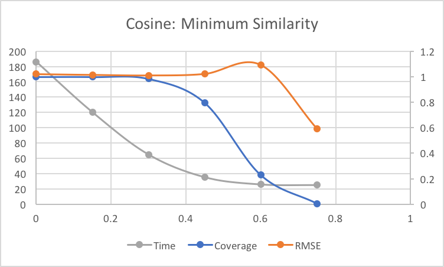
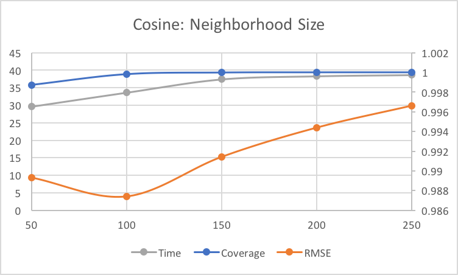
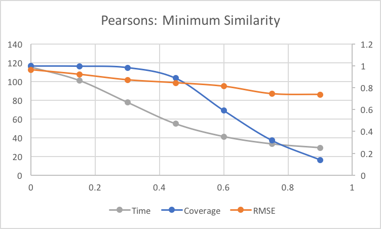
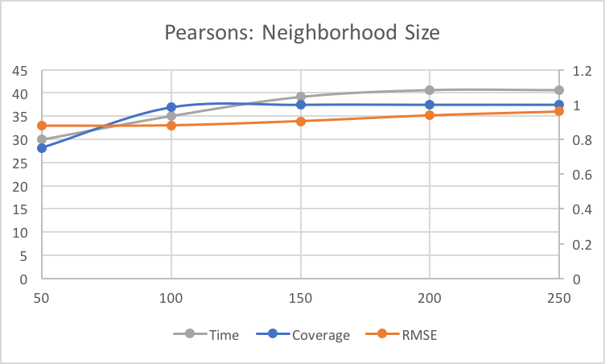
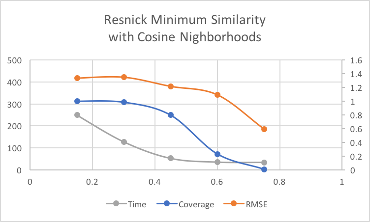
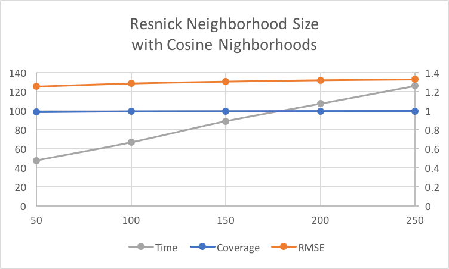
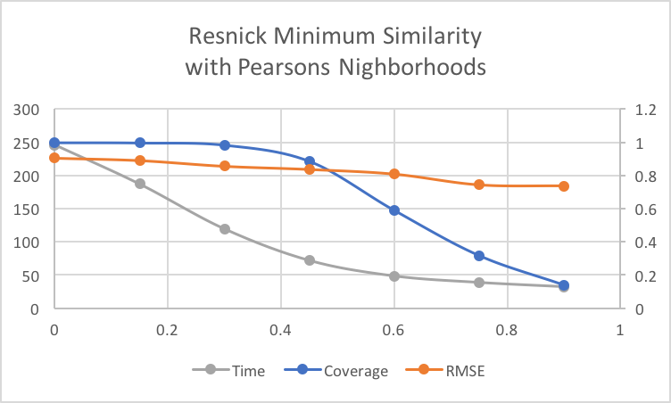
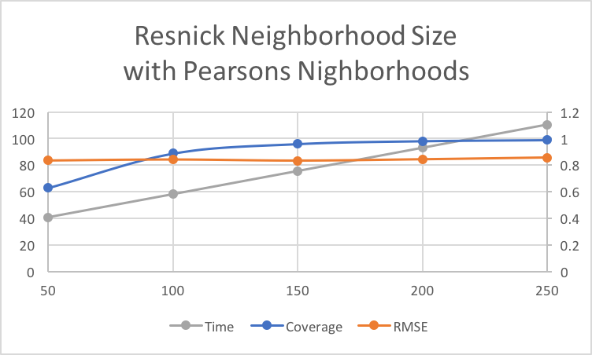

# User-Based Collaborative Filtering System
As the title implies, this project is a user-based collaborative filtering system created for generating predictions for the [Movie Lens](https://grouplens.org/datasets/movielens/100k/) 100k dataset originally developed for the [University of Minnesota](https://grouplens.org/datasets/movielens/100k/). The main goals were to: understand the dataset through simple metrics, make efficient predictions, evaluation prediction performance, and run a variety of large scale experiments. 

## Data Observations
- Unique movies: 943
- Unique users: 943
- Average Rating: 3.52986
- Ratings density metric: .112454442
- Total number of...
	- 1 star ratings: 6110
	- 2 star ratings: 11,370
	- 3 star ratings: 27,145
	- 4 star ratings: 34,174
	- 5 star ratings: 21,201
	- Total: 100,000

## Testing

### Leave-One-Out
Leave-One-Out (L1O) testing involves taking a rating in your dataset, running a prediction on it as it it doesn't exist, and then comparing the prediction with actual rating. 

### Measuring Accuracy with Root Means Squared Error
Root means squared error (RMSE) is the primary metric in which the accuracy of a prediction technique. It takes the root mean of all of the prediction accuracies and then squares it to ensure the result is a positive number.
$$ |\overline{E}|=\frac{\displaystyle\sum_{i=1}^{N}|p_i-r_i|^2}{N} $$ 

### Measuring Coverage
Coverage is the amount of ratings possible when using a certain set of parameters within a prediction technique. For example, Mean item Rating uses all available ratings to create it's prediction so it can always generate a prediction, but later we will see the use of minimum similarity neighborhoods, in which there are cases where a prediction isn't possible. I calculated coverage with the equation below. 

$$ Coverage(data)=\frac{\displaystyle\sum_{item\in data}canRate(item)}{|data|} $$

### Measuring Efficiency
Efficiency is a measure of how fast a prediction technique takes to calculate. There is commonly a trade off to be had between efficiency, accuracy, and coverage. In this case, I utilized the [Python Time Library](https://docs.python.org/2/library/time.html) to quantify the efficiency of a technique.

## Baseline Prediction with Mean Item Rating
$$ prediction(u_i, item_k) = \displaystyle\sum_{u_j\in users} rating(u_j, item_k)$$
Mean item rating simply takes the average rating of an item and uses that as a prediction. This method is incredibly simple to implement, but is also naive because it treats every rating with equal value and didn’t take any other data into consideration. The use of data outside the mean rating is why the other formulas are much more successful.

## Predictions Using Distance-Based Similarity 

The first serious approach utilizes Cosine and Pearsons similarity between users to build neighborhoods. From this neighborhood I took the mean item rating of the target movie and use this as my prediction. There are two types of neighborhoods ones created by setting a minimum similarity and ones created by limiting the size of the neighborhood. The neighborhoods constructed with minimum similarity were tested at a minimum of zero similarity all the way to ninety percent similarity, testing in increments of fifteen percent and the neighborhoods constructed with a neighborhood size was tested at values ranging from fifty to two hundred and fifty, testing in increments of fifty users. The outcomes of these tests are seen in the graphs below. 

Minimum Similarity | Neighborhood Size
:--: | :--: 
 | 
 | 

## Predictions Using Resnick's Formula

Our last and most accurate approach was using Resnick’s Prediction Formula. We used both cosine and Pearsons to calculate similarity metrics and used each of those methods along with neighborhood building with maximum size and minimum similarity. Resnick’s Prediction Formula proved to be very slow in all cases, but capable of producing some of the most accurate results. 

Resnick Minimum Similarity | Resnick Neighborhood Size
:--: | :--: 
 | 
 | 

## References

\[Harper and Konstan 2015\] F. Maxwell Harper and Joseph A. Konstan. 2015. The MovieLens Datasets: History and Context. From ACM Transactions on Interactive Intelligent Systems (TiiS) 5, 4, Article 19 (December 2015), 19 pages. DOI=http://dx.doi.org/10.1145/2827872

\[Resnick, Iacovou, Suchak, Bergstrom, Bergstrom, and Riedl 1994\] Paul Resnick, Neophytos Iacovou, Mitesh Suchak, Peter Bergstrom, John Riedl. 1994. GroupLens: An Open Architecture for Collaborative Filtering of Netnews. From Proceedings of ACM 1994 Conference on Computer Supported Cooperative Work, Chapel Hill, NC: Pages 175-186